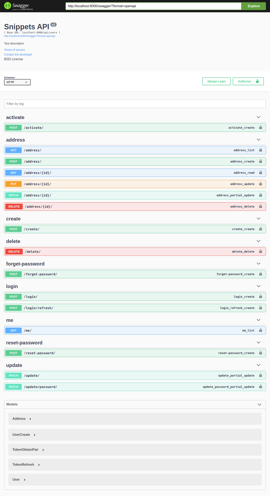

# App de Usuários

Esse é um app de usuários personalizado feito em Django REST Framework, nele eu modifiquei o model padrão de users do Django, adicionando campos como CPF, data de nascimento e outros. Também exclui o campo username, deixando o sistema de login apenas com campos de email e senha, criei funcionalidades relacionadas a conta do usuário, como criar e ativar a conta, visualizar, atualizar e deletar seus dados, com envios de e-mails para ativação da conta e redefinição de senha usando Celery e RabbitMQ(Message Broker), e todas as funcionalidades com testes automatizados. O processo login(obtenção do token de acesso) e refresh do token é feito com a lib simple-jwt. 

### O que tem na API?

- Modelo de usuário personalizado 
- Login com email e senha usando JWT
- Funcionalidades da conta do usuário 
- CRUD de endereços do usuário 
- Testes automatizados para todas funcionalidades

### Arquivo ENV necessário para rodar o projeto

Se você desejar clonar esse repositório e rodar na sua máquina para testar, terá de adicionar um arquivo .env na pasta raiz com as seguintes variáveis:

**OBS:** Sugiro que crie uma venv para evitar problemas.

```
SECRET_KEY=<Secret Key do projeto (pode ser a que o django mesmo gera)>
EMAIL_HOST=<Host de email (Eu usei o mailtrap para testes)> 
EMAIL_HOST_USER= <Usuário da conta de email>
EMAIL_HOST_PASSWORD=<Senha do email>
EMAIL_PORT=<Porta do provedor>
```

Você pode rodar o comando a seguir para criar um `.env` de exemplo.

```
python contrib/env_gen.py
```

### E como rodar o projeto?

Depois de clonar o repositório, criar e ativar a venv e configurar devidamente as variáveis ambientes, siga os passos para rodar e testar o projeto:

Instale o Message Broker RabbitMQ no seu computador, no meu caso, fiz no Windows, porém o processo pode ser diferente em outros sistemas operacionais, para isso siga os passos no site oficial: https://www.rabbitmq.com/download.html

Após instalado, verifique a url de acesso a ele e modifique caso necessário no arquivo `settings.py`.

Para iniciar o celery, utilize o seguinte comando no terminal:

`celery -A drf_users_app worker -l info -P eventlet`

```
# Instalar as libs necessárias
pip install -r requirements.txt

python manage.py migrate

python manage.py runserver
```

Ao rodar a aplicação entre em http://localhost:8000/api/users/create/

preencha, e salve os dados.

Em seguida, você receberá um e-mail com link de ativação, seria o link do frontend da aplicação, pegue somente o **token** da url e envie para /api/users/activate com o body `{"token": token}` e você receberá um status code 200, o que quer dizer que sua conta foi ativada no sistema.

**Obs**: sugiro que use Postman ou Insomnia.

Agora com sua conta já ativada, você poderá fazer o login pra ter acesso as funcionalidades, pra isso envie no body da requisição o email e senha para a rota /api/users/login/ .

A resposta será um *token de refresh* e um *token de acesso*. Com o *token de acesso* você poderá mandar no header das requisições que necessitam de autenticação com o esquema de `Bearer token`, exemplo: `GET api/users/me/` se você estiver autenticado receberá como retorno seus dados de cadastro.


**Pronto! o projeto já deve estar no ar e funcionando corretamente.**


## Swagger

No endereço http://localhost:8000/swagger/

você tem uma doc feita com [drf-yasg](https://drf-yasg.readthedocs.io/en/stable/readme.html#installation) que te mostra todos os endpoints do sistema.




## MailHog

Se quiser rodar [MailHog](https://github.com/mailhog/MailHog) via Docker. Você pode receber os e-mails localmente através dele.

```
docker run -d -p 1025:1025 -p 8025:8025 mailhog/mailhog
```

